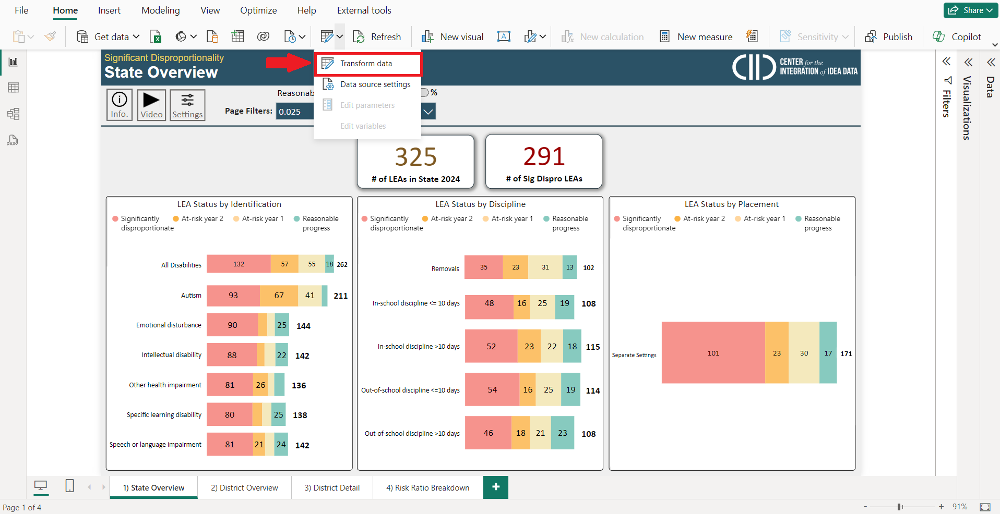
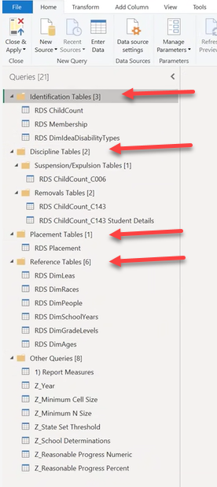
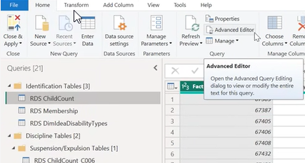
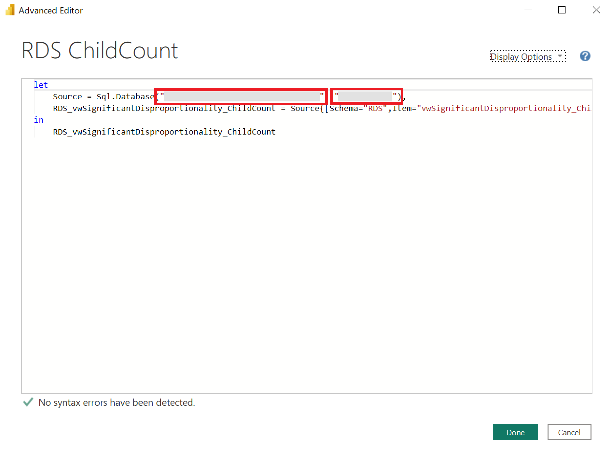
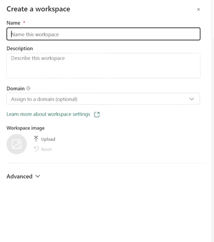
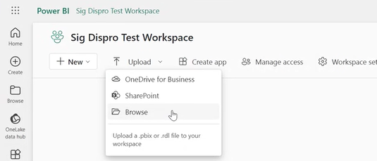
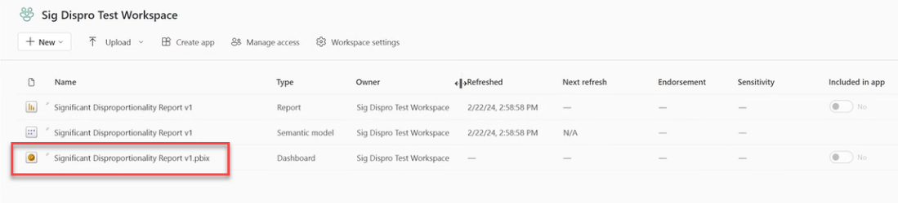
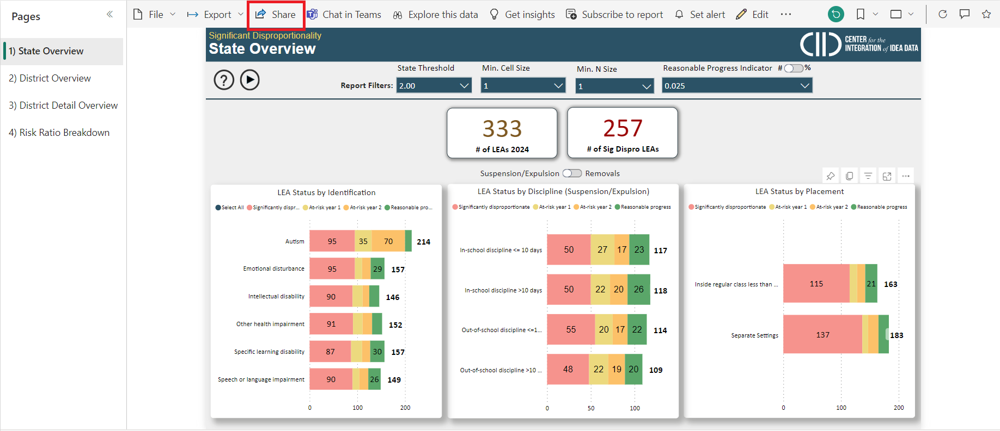
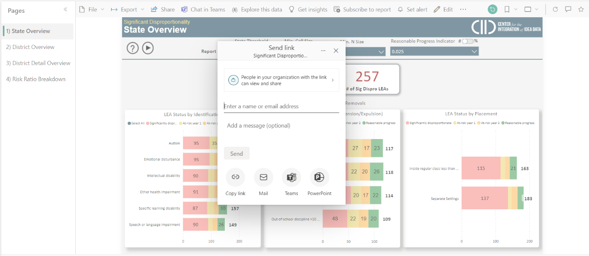
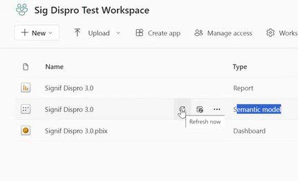

# Setup Guide


**Privacy Notice:** When using this report, be aware that it is not intended to be public facing, as it contains PII and small cell sizes that may allow students to be identified.


***

### Prerequisites

* [x] This report requires states to be users of **Generate** or a **CEDS Data Warehouse.**
* [x] Three years of data migrated into Generate for EDPass Files:
  * FS052 – Membership
  * FS002 – Children with Disabilities (School Age)
  * FS006 – Students with Disabilities (IDEA) Suspensions/Expulsions
  * FS143 – Children with Disabilities (IDEA) Total Disciplinary Removals
* [x] The latest version of Power BI Desktop
* [x] Access to the CEDS Data Warehouse
* [x] VPN Access if required

### Preparing CEDS Data Warehouse

The Significant Disproportionality report uses stored views of data in the Reporting Tables. These views are not standard but can be added to your instance of Generate’s semantic layer easily. This process does not require any server backups.

Generate Significant Disproportionality views were developed to represent the data used for Child Count, Membership, Placement, and Discipline data in C006 and C143 IDEA reports. These files were developed using Generate 12.3 released in early 2025 and they use the same logic for returning the IDEA submission report results. The views contain fact and dimension table ids that are joined with other fact and dimension tables within the data warehouse to return other data elements used within the BI report.

#### **The Required views are:**



```sql
vwSignificantDisproportionality_Membership
```

**Description:** All students that are enrolled in a school for the report year, are in grades ungraded, 'AE', and PK through 12 and are between the ages 3-21

**Fields Returned:**

* Fact.FactK12StudentCountId
* Fact.K12StudentId
* Fact.SchoolYearId
* Fact.LeaId
* LEAs.LeaIdentifierSea
* LEAs.LeaIdentifierNces
* Fact.RaceId
* Fact.IdeaStatusId
* Fact.GradeLevelId
* Fact.AgeId
* 1 AS MembershipStudentCount



```
vwSignificantDisproportionality_ChildCount
```

**Description:** All IDEA students that are enrolled in a school for the report year, and are between the ages 3-21

**Fields Returned:**

* Fact.FactK12StudentCountId
* Fact.PrimaryDisabilityTypeID
* Fact.K12StudentId
* Fact.SchoolYearId
* Fact.LeaId
* LEAs.LeaIdentifierSea
* LEAs.LeaIdentifierNces
* Fact.RaceId
* Fact.IdeaStatusId
* Fact.GradeLevelId
* Fact.AgeId
* 1 AS ChildCountStudentCount



```
vwSignificantDisproportionality_C006
```

**Description:** Aggregated counts of IDEA students that are not parentally placed in private school, and Idea Interim Removal EDFactsCode is not REMDW (removal for drugs, weapons, or serious bodily injury) or REMHO (removed based on a Hearing Officer finding), and are between the ages 3-21

**Fields Returned:**

* K12StudentId
* PrimaryDisabilityTypeId
* SchoolYearId
* LeaId
* RaceId
* LeaIdentifierSea
* LeaIdentifierNces
* IdeaStatusId
* GradeLevelId
* AgeId
* INSCHOOL\_LTOREQ10 (In school removal length less than or equal 10)
* INSCHOOL\_GREATER10 (In school removal length greater than 10)
* OUTOFSCHOOL\_LTOREQ10 (Out of school removal length less than or equal 10)
* OUTOFSCHOOL\_GREATER10 (Out of school removal length greater than 10)



```
vwSignificantDisproportionality_C143
```

**Description:** Aggregated counts of IDEA students that are not parentally placed in private school, has a disciplinary action taken is either expulsion with services or expulsion without services, individual duration of disciplinary action is greater or equal to 0.5, and they are between the ages 3-21

**Fields Returned:**

* SchoolYearId
* LeaId
* RaceId
* LeaIdentifierSea
* LeaIdentifierNces
* DisciplineCount (Aggregated count)



```
vwSignificantDisproportionality_C143_StudentDetails
```

**Description:** All students that are included in the view vwSignificantDisproportionality\_C143

**Fields Returned:**

* K12StudentId
* SchoolYearId
* LeaId
* RaceId
* LeaIdentifierSea
* LeaIdentifierNces
* DisciplineCount (Aggregated count by student)



```
vwSignificantDisproportionality_Placement
```

**Description:** All IDEA students by Idea Educational Environment

**Fields Returned:**

* K12StudentId
* SchoolYearId
* RaceId
* GradeLevelId
* LeaIdentifierSea
* PrimaryDisabilityTypeID
* IdeaEducationalEnvironmentForSchoolAgeCode
* IdeaEducationalEnvironmentForSchoolAgeDescription



#### Adding the Views

1. Save the provided script views.&#x20;


```git
git clone https://github.com/CEDS-Collaborative-Exchange/CIID-Reports.git
```


{% @github-files/github-code-block url="https://github.com/CEDS-Collaborative-Exchange/CIID-Reports/tree/5bad8914cec558ab7428bad9fd0aab8f962b03a6/significant-disproportionality/SQL%20Views" %}


1. Open SQL Management Studio (or similar tool).
2. Execute the script to add the views to your data warehouse.
3. If changes are made to field names or values, update the BI tool accordingly.


The logic in these views may need to be changed if the reporting requirements change for how child count, placement, or reports 006 and 143.


***

### Connecting the report to the source


Remember to connect to the VPN if required by your network administrators.


1. Download the .pbix file from [CEDS Collaborative Exchange’s GitHub folder](https://github.com/CEDS-Collaborative-Exchange/CIID-Reports).

{% @github-files/github-code-block url="https://github.com/CEDS-Collaborative-Exchange/CIID-Reports/raw/5bad8914cec558ab7428bad9fd0aab8f962b03a6/significant-disproportionality/Significant%20Disproportionality%20Report.pbix" fullWidth="false" %}



The downloaded report contains cached test data. This test data was created by CIID for this report's production and is not intended to represent any actual state data.&#x20;


2. Open the .pbix file in Power BI Desktop.
3. Click "**Transform Data**" in the home ribbon, then select "**Transform Data**" again to open Power Query.

<figure><figcaption><p>Navigating Power Query in Excel for Data Transformation</p></figcaption></figure>

4. In Power Query, the queries contain a list of tables and report measures essential to the report. Each table needs to be pointed to your CEDS Data Warehouse to ensure that the correct source data is used for the report. This includes each of the queries in the following folders:
   * Identification Tables
   * Discipline Tables
   * Placement Tables
   * Reference Table Tables

<div data-full-width="false"><figure><figcaption><p>Connecting Power Query Tables to CEDS Data Warehouse</p></figcaption></figure></div>

5. Click on each table, and then select the advanced editor.

<figure><figcaption><p>Accessing the Advanced Editor for table customization.</p></figcaption></figure>

6. Update each table's IP Address and Database name in the Advanced Editor. Tables to Update:
   * RDS ChildCount
   * RDS Membership
   * RDS.Placement
   * RDS.ChildCount\_C006
   * RDS ChildCount\_C143
   * RDS DimLeas
   * RDS DimRaces
   * RDS DimPeople
   * RDS DimSchoolYears
   * RDS DimGradeLevels
   * RDS DimAges

<figure><figcaption><p>Updating IP addresses and database names in the Advanced Editor.</p></figcaption></figure>

7. Click "Apply" then save the report after each query. Applying and saving after each query will allow you to troubleshoot easier if you run into issues with a single query. After refreshing, the data will be cached in the .pbix file.&#x20;
8. Close Power Query.

***

### Distribution


This report includes Student ID numbers and other personally identifiable information (PII) cached in the .pbix file. Ensure it is shared only with authorized individuals. Refer to your SEA’s policies and procedures before sharing.


While the .pbix can be sent to individuals with Power BI Desktop, CIID recommends that this report is distributed with internal state staff through an Online Power BI Workspace. Doing this ensures access can be limited to appropriate individuals, that the report cannot be edited, and provides multiple sharing options, such as embedding into a Teams Channel.

#### Online Power BI Workspace

1. Sign into office.com and select Power BI.
2. Create a new workspace.

<figure><figcaption><p>Setting up a new workspace for productivity.<br></p></figcaption></figure>

3. Upload the .pbix file to the workspace.

<figure><figcaption><p>Screenshot of the Power BI service interface with a focus on the ‘Sig Dispro Test Workspace’.</p></figcaption></figure>

After the report is uploaded in the workspace, the dashboard will be available to use and share by clicking on the .pbix file.

<figure><figcaption><p>Screenshot of a digital workspace with reports ready for use.</p></figcaption></figure>

4. Manage permissions by clicking "Share" and selecting the appropriate individuals.

<figure><figcaption><p>Screenshot of the Significant Disproportionality Report in Power BI. Manage permissions by clicking 'Share' and selecting the appropriate individuals.</p></figcaption></figure>

5. Type in the name of the person you want to share with. Then click the method you would like to send through.

<figure><figcaption><p>Screenshot of the Significant Disproportionality Report in Power BI, showing the State Overview page and the 'Send link' dialog box, which allows users to share the report with colleagues via email, Teams, or by copying the link.</p></figcaption></figure>

***

### Refreshing Data&#x20;

Administrators of the report can refresh the data in different ways:

**Desktop .pbix file:** Click the refresh button to view updated data.


If this report is being used in the workspace, after refreshing data, then click publish to allow authorized users to view the data.


Online Workspace: Go to the semantic model and click the refresh button.  &#x20;

<figure><figcaption><p>Refreshing the Semantic Model in the Sig Dispro Test Workspace.</p></figcaption></figure>

***

### Adjusting Years

By default, the report loads the latest three years of data. However, depending on when you access the report, some files' data may appear blank. If this happens, it may be helpful to load the previous three years _excluding_ the current year.

To adjust the report to view the previous three years (excluding the current year), follow these steps:



### Open the report in Power BI Desktop

<figure><figcaption></figcaption></figure>



### Under the 'Home' tab, click the table icon then 'Transform data' to take you to the Power Query page.&#x20;

<figure><figcaption></figcaption></figure>



### In the left-hand panel under the 'Parameters' section, select the 'YearSelection' parameter.&#x20;

<figure><figcaption></figcaption></figure>



### Under the 'Current Value' dropdown, select 'Latest 3 years minus latest year'.

<figure><figcaption></figcaption></figure>





### Click 'Close & Apply'




