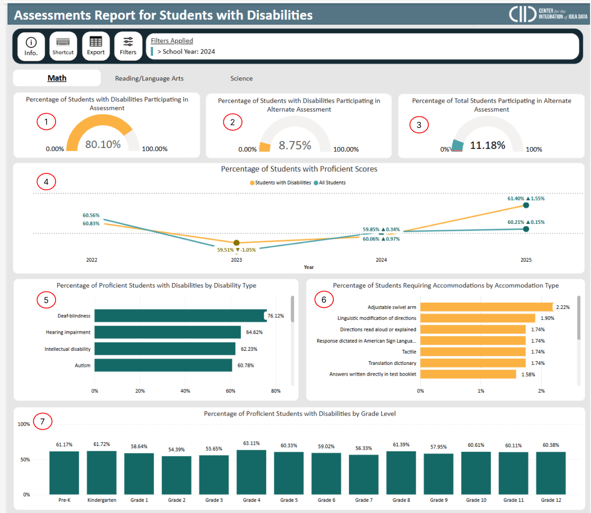

# Data Dictionary

<figure><figcaption></figcaption></figure>

<table><thead><tr><th width="96">Type</th><th width="411">Calculation Name</th><th width="151.9998779296875" align="center">Connected Visuals</th><th width="179.3333740234375">Description</th><th width="800">DAX Code</th></tr></thead><tbody><tr><td>Measure</td><td>AssessmentParticipatingK12IdeaPercentREDACTED</td><td align="center">1</td><td>Calculation for the percent of IDEA students who participated in the state assessment. Value is suppressed for count of participating IDEA students less than 10. </td><td>

<pre class="language-dax"><code class="lang-dax">AssessmentParticipatingK12IdeaPercentREDACTED = 
VAR AssessmentParticipatingK12IdeaCount =
    CALCULATE(
        COUNT('2) RDS vwStateAssessments'[K12StudentId]),
        'RDS DimAssessmentRegistrations'[AssessmentRegistrationParticipationIndicatorCode] = "Participated",
        'RDS DimIdeaStatuses'[IdeaIndicatorCode] = "Yes"
    )
VAR AssessmentParticipationK12IdeaCount = 
CALCULATE(
    COUNT('2) RDS vwStateAssessments'[K12StudentId]),
    'RDS DimAssessmentRegistrations'[AssessmentRegistrationParticipationIndicatorCode] IN {"Participated", "DidNotParticipate"},
    'RDS DimIdeaStatuses'[IdeaIndicatorCode] = "Yes"
)
VAR AssessmentParticipatingK12IdeaPercent =
    DIVIDE(AssessmentParticipatingK12IdeaCount, AssessmentParticipationK12IdeaCount)

RETURN
    IF(AssessmentParticipatingK12IdeaCount &#x3C; 10, BLANK(), AssessmentParticipatingK12IdeaPercent)
</code></pre></td></tr><tr><td>Measure</td><td>AlternateAssessmentK12IdeaPercentREDACTED</td><td align="center">2</td><td>Percent of IDEA students who have participated in the alternate state assessment. Value is suppressed for count of IDEA students taking the alternate assessment under 10. </td><td>

<pre class="language-dax"><code class="lang-dax">AlternateAssessmentK12IdeaPercentREDACTED = 
VAR AlternateAssessmentK12IdeaCount = 
CALCULATE(
    COUNT('2) RDS vwStateAssessments'[K12StudentId]),
    'RDS DimAssessmentRegistrations'[AssessmentRegistrationParticipationIndicatorCode] = "Participated",
    'RDS DimAssessments'[Alternate Assessment Status] = "Alternate",
    'RDS DimIdeaStatuses'[IdeaIndicatorCode] = "Yes"
)
VAR AssessmentK12IdeaCount = 
CALCULATE(
    COUNT('2) RDS vwStateAssessments'[K12StudentId]),
    'RDS DimAssessmentRegistrations'[AssessmentRegistrationParticipationIndicatorCode] = "Participated",
    'RDS DimAssessments'[Alternate Assessment Status] IN {"Alternate", "Standard"},
    'RDS DimIdeaStatuses'[IdeaIndicatorCode] = "Yes"
)

VAR AlternateAssessmentK12IdeaPercent = 
DIVIDE(
    AlternateAssessmentK12IdeaCount,
    AssessmentK12IdeaCount
)

RETURN
IF(
    AlternateAssessmentK12IdeaCount &#x3C; 10,
    BLANK(),
    AlternateAssessmentK12IdeaPercent
)
</code></pre></td></tr><tr><td>Measure </td><td>AlternateAssessmentK12StudentPercentREDACTED</td><td align="center">3</td><td>Percent of all students who have opted to take the alternate state assessment. Value is suppressed for count of K12 students taking the alternate assessment under 10. </td><td>

<pre class="language-dax"><code class="lang-dax">AlternateAssessmentK12StudentPercentREDACTED = 
VAR AlternateAssessmentK12Count = 
CALCULATE(
    COUNT('2) RDS vwStateAssessments'[K12StudentId]),
    'RDS DimAssessmentRegistrations'[AssessmentRegistrationParticipationIndicatorCode] = "Participated",
    'RDS DimAssessments'[Alternate Assessment Status] = "Alternate"
)
VAR AssessmentK12Count = 
CALCULATE(
    COUNT('2) RDS vwStateAssessments'[K12StudentId]),
    'RDS DimAssessmentRegistrations'[AssessmentRegistrationParticipationIndicatorCode] = "Participated",
    'RDS DimAssessments'[Alternate Assessment Status] IN {"Alternate", "Standard"}
)
VAR AlternateAssessmentK12Percent = 
DIVIDE(
    AlternateAssessmentK12Count,
    AssessmentK12Count
)
RETURN
IF(
    AlternateAssessmentK12Count &#x3C; 10,
    BLANK(),
    AlternateAssessmentK12Percent
)
</code></pre></td></tr><tr><td>Measure</td><td>AssessmentProficientK12IdeaProportion</td><td align="center">4</td><td>Percent of IDEA students who scored proficient on the state assessment. </td><td>

<pre class="language-dax"><code class="lang-dax">AssessmentProficientK12IdeaProportion = 
DIVIDE(
    //Count of Proficient IDEA students
    CALCULATE(
    COUNTROWS('2) RDS vwStateAssessments'),
    '2) RDS vwStateAssessments'[ProficiencyStatus] = "PROFICIENT",
    'RDS DimIdeaStatuses'[IdeaIndicatorCode] = "Yes"),

    //Count of Proficent/NotProficient IDEA Students
    CALCULATE(
    COUNT('2) RDS vwStateAssessments'[K12StudentId]),
    '2) RDS vwStateAssessments'[ProficiencyStatus] IN {"PROFICIENT", "NOTPROFICIENT"},
    'RDS DimIdeaStatuses'[IdeaIndicatorCode] = "Yes"
)
)
</code></pre></td></tr><tr><td>Measure</td><td>AssessmentProficientProportion</td><td align="center">4</td><td>Percent of all students who scored proficient on the state assessment. </td><td>

<pre class="language-dax"><code class="lang-dax">AssessmentProficientProportion = 
DIVIDE(
    //Count of Proficient IDEA students
    CALCULATE(
    COUNTROWS('2) RDS vwStateAssessments'),
    '2) RDS vwStateAssessments'[ProficiencyStatus] = "PROFICIENT"),

    //Count of Proficent/NotProficient IDEA Students
    CALCULATE(
    COUNT('2) RDS vwStateAssessments'[K12StudentId]),
    '2) RDS vwStateAssessments'[ProficiencyStatus] IN {"PROFICIENT", "NOTPROFICIENT"}
)
)
</code></pre></td></tr><tr><td>Measure</td><td>AssessmentProficientK12IdeaPercentREDACTED</td><td align="center">5, 6, 7</td><td>The percent of IDEA students who have scored proficient on the state assessment. Value is suppressed for count of IDEA students who scored proficient on the state assessment under 10. </td><td>

<pre class="language-dax"><code class="lang-dax">AssessmentProficientK12IdeaPercent = 
VAR AssessmentProficientK12IdeaCount = 
CALCULATE(
    COUNT('2) RDS vwStateAssessments'[K12StudentId]), 
    '2) RDS vwStateAssessments'[ProficiencyStatus] = "PROFICIENT",
    'RDS DimIdeaStatuses'[IdeaIndicatorCode] = "Yes",
    'RDS DimAssessmentRegistrations'[AssessmentRegistrationParticipationIndicatorCode] = "Participated"
)
VAR AssessmentParticipatingK12IdeaCount = 
CALCULATE(
    COUNT('2) RDS vwStateAssessments'[K12StudentId]),
    'RDS DimAssessmentRegistrations'[AssessmentRegistrationParticipationIndicatorCode] = "Participated",
    'RDS DimIdeaStatuses'[IdeaIndicatorCode] = "Yes" 
)
VAR AssessmentProficientK12IdeaPercent =
DIVIDE(
    AssessmentProficientK12IdeaCount,
    AssessmentParticipatingK12IdeaCount
)
RETURN
IF(
    AssessmentProficientK12IdeaCount &#x3C; 10,
    BLANK(),
    AssessmentProficientK12IdeaPercent
)
</code></pre></td></tr></tbody></table>

