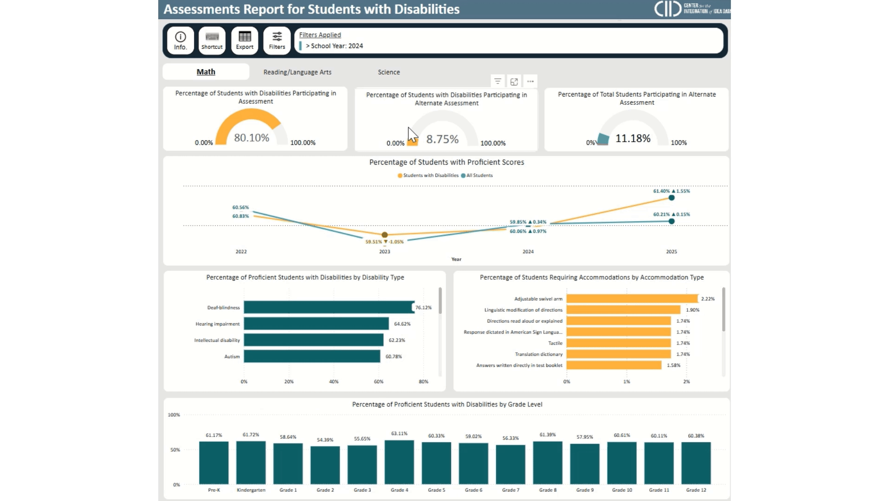

# IDEA State Assessments

### Explore the Report

### Overview

This report uses four years of state assessment **test** data for mathematics, reading/language arts, and science to examine trends in participation and proficiency for students with disabilities. The report is intentionally designed to fulfill the public reporting requirements for IDEA Section 618 state assessment data, displaying the data by disability, grade, assessment type and accommodations. The report further allows states to disaggregate the data using filters for various subgroups and subgroup combinations.

**Report Pages**

1. **Math:** Highlights math assessment participation, proficiency trends, and accommodation usage among students with disabilities.
2. **Reading/Language Arts:** Displays participation, proficiency, and accommodations data for students with disabilities on state reading/language arts assessments.
3. **Science:** Provides insights into science assessment outcomes, participation rates, and accommodations for students with disabilities.


Please note that the data presented in the report is fictitious and for illustrative purposes only. Click full screen mode in the bottom right corner for optimal viewing.&#x20;



Embedded Power BI Report: State Assessments


### Features

#### Data Suppression

To protect individual privacy, all visuals in the reports have cell sizes under 10 suppressed. There are no drilldown features, as all personally identifiable data (PII) have been removed.

#### Adjustable Filters

<figure><figcaption>
Filters button reveals slicer panel. Slicer selections show in the 'Filters Applied' panel in the top navigation bar. 
</figcaption></figure>

#### Keyboard Shortcuts

Pressing "Shift + ?" will enable a pop-up that shows several different keyboard shortcuts and accessibility features.

<figure><figcaption>
Hover over shortcut button to reveal instructions for navigation shortcuts. 
</figcaption></figure>

## Webinar



