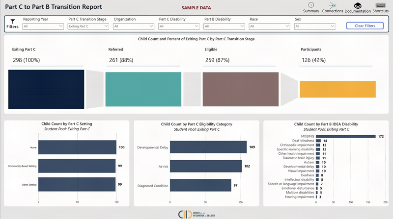

# Part C  to Part B Transition

## Overview

The Part C to Part B Transition BI Report grew out of CIID’s broader effort to help states move beyond collecting IDEA data for compliance and toward using integrated data to better understand children’s experiences and outcomes. Early conversations with Part C stakeholders consistently highlighted the challenges of connecting Part C and Part B data, tracking transitions across systems, and turning those data into information that program leaders can readily use. In response, CIID developed this Power BI report as an accessible, CEDS-aligned starting point for visualizing Part C-to-Part B transition data. This report is the first piece of a larger Part C solution that CIID will continue to build with states, expanding over time to support stronger data integration, longitudinal analysis, and actionable reporting across early intervention, preschool special education, and broader education systems.

The primary funnel chart visualization represents **four major transition stages**: Exiting Part C Pool, Referred to Part B Pool, Eligible for Part B Pool, and Confirmed Part B Participant Pool. Together, these stages show how children move from receiving early intervention services to potentially receiving preschool special education services. By examining the relationships between these populations, state agencies can better understand referral outcomes, eligibility determinations, and participation rates, while also identifying opportunities to strengthen coordination, data sharing, and continuity of services between Part C and Part B programs.

## Prerequisites

* [x] This report requires states to be users of **Generate** or a **CEDS Data Warehouse.**
* [x] The latest version of Power BI Desktop
* [x] VPN access if required

## Explore the Report


Please note that the data presented in the report is fictitious and for illustrative purposes only. Click full screen mode in the bottom right corner for optimal viewing.&#x20;




## Features

### Filter By Part C Transition Stage&#x20;

Use the _Part C Transition Stage_ filter to focus on a specific student population within the transition process. Selecting _Exiting Part C_, _Referred to Part B_, _Eligible for Part B_, or _Confirmed Part B Participant_ updates the bar charts to show data for that population only. The visualizations are color-coded to match the selected stage in the funnel chart, making it easier to understand which group of students is being analyzed throughout the report.

<figure><figcaption></figcaption></figure>

### Keyboard Shortcuts

Pressing "Shift + ?" will enable a pop-up that shows several different keyboard shortcuts and accessibility features.

{% embed url="https://files.gitbook.com/v0/b/gitbook-x-prod.appspot.com/o/spaces%2FHAHl5HOGCftPC1825lgk%2Fuploads%2FH3sJcb7I2NIgYNwmXZ2q%2FShortcuts_2.gif?alt=media&token=6c2c7f6a-6929-4e6d-8fec-84d108120db1" %}
