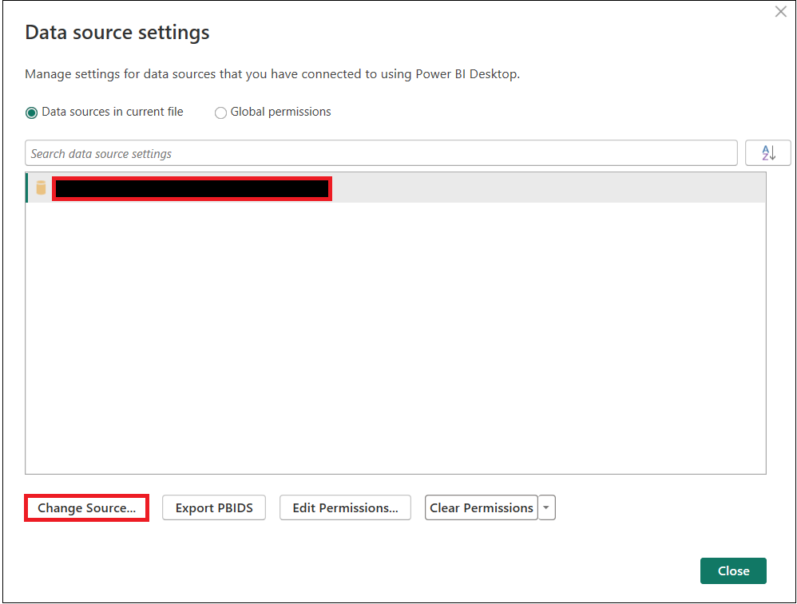
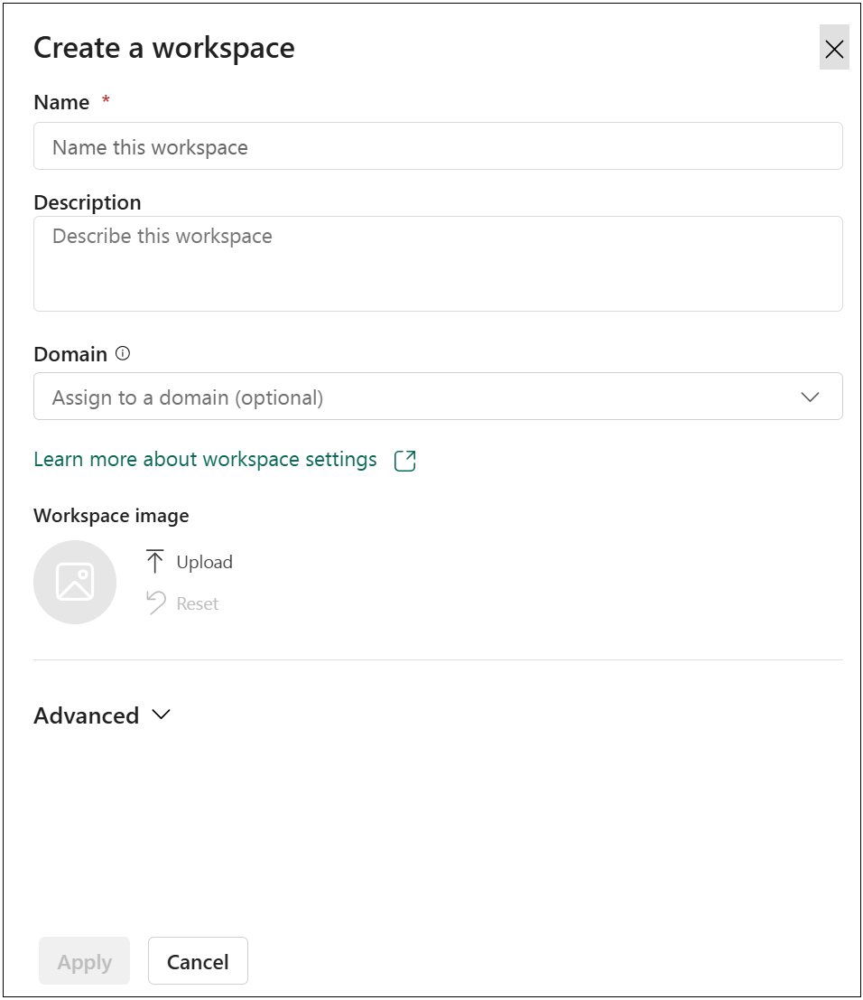
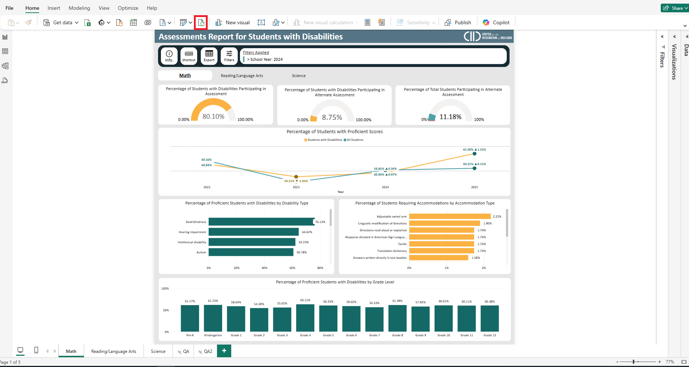
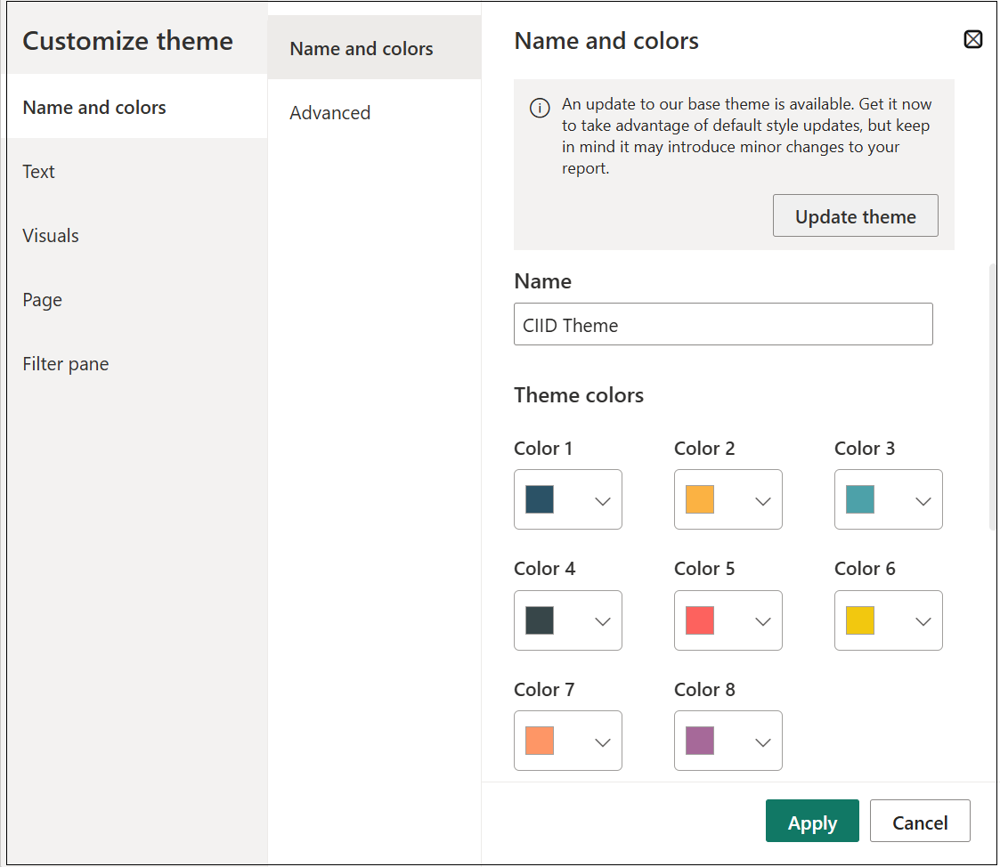

# Setup Guide

**Privacy Notice:** This report is intended for public release. Please ensure that suppression thresholds and functionality are aligned with your state’s policy and all necessary quality assurance checks and testing are completed prior to publication.

***

### Prerequisites

* [x] This report requires states to be users of **Generate** or a **CEDS Data Warehouse.**
* [x] Three years of data migrated into Generate for EDPass files:
  * FS175 – Academic Achievement in Mathematics
  * FS178 – Academic Achievement in Reading/Language Arts
  * FS179 – Academic Achievement in Science
  * FS185 – Assessment Participation in Mathematics
  * FS188 – Assessment Participation in Reading/Language Arts
  * FS189 - Assessment Participation in Science
* [x] The latest version of Power BI Desktop
* [x] Access to the CEDS Data Warehouse
* [x] VPN access if required

### Preparing CEDS Data Warehouse

The Assessments report uses stored views of data in the Reporting Tables. These views are not standard but can be added to your instance of Generate’s semantic layer easily. This process does not require any server backups.

Generate's Assessment view was developed to represent the data used for academic achievement and assessment participation. These files were developed using Generate 12.3 released in early 2025 and they use the same logic for returning the IDEA submission report results. The views contain fact and dimension table ids that are joined with other fact and dimension tables within the data warehouse to return other data elements used within the BI report.

#### Adding the Views

1. Save the provided script view below:

{% @github-files/github-code-block url="https://github.com/CEDS-Collaborative-Exchange/CIID-Reports/blob/main/02)%20assessments/SQL%20Views/vwStateAssessments.txt" visible="true" fullWidth="false" %}

1. Open SQL Management Studio (or similar tool).
2. Execute the script to add the views to your data warehouse.
3. If changes are made to field names or values, update the BI tool accordingly.

***

### Connecting Report to Data Source


Remember to connect to the VPN if required by your network administrators.


1. Download the ".pbix" report file from the CEDS Collaborative Exchange:

{% @github-files/github-code-block url="https://github.com/CEDS-Collaborative-Exchange/CIID-Reports/blob/main/02)%20assessments/Assessments%20Report.pbix" %}

1. Open the .pbix file in Power BI Desktop.


The downloaded report contains cached **test** data. This test data was created for this report's demonstration and is not intended to represent any actual state data.


<figure><figcaption></figcaption></figure>

3. Under the Home tab, click the drop down to access the "Data source settings".

<figure><figcaption></figcaption></figure>

4. In the "Data source settings" panel, select the default data source then click "Change Source...".

<figure><figcaption></figcaption></figure>

5. In the "SQL Server database" panel, replace the "Server" and "Database" fields with your organization's credentials. Click 'OK' when finished.

<figure><figcaption></figcaption></figure>

### Distribution


Ensure this report is shared only with authorized individuals. Refer to your agency's policies and procedures before sharing this report.


While the .pbix can be sent to individuals with Power BI Desktop, it is recommended this report is distributed through a Power BI Workspace. This ensures that access is limited to appropriate individuals, the report remains read-only, and multiple sharing options are available.

### Setting up a Power BI Workspace

1. Sign into office.com and select Power BI in the top left menu bar.

<figure><figcaption></figcaption></figure>

2. Click "Workspaces" on the left menu bar.

<figure><figcaption></figcaption></figure>

3. Click "+ New Workspace" then fill out the required fields. Select "Apply" when finished.

<figure><figcaption></figcaption></figure>

4. To import the report into the newly created workspace, select "Import" then "Report or Paginated Report". Then select your .pbix file from the storage options listed.

<figure><figcaption></figcaption></figure>

5. The report is now uploaded into your workspace. You can manage permissions, data refresh, and distribution from this workspace.

<figure><figcaption></figcaption></figure>

### Data Refresh

Administrators of the report can refresh the data in different ways:

#### Option 1: Refresh from Power BI Desktop

1. Open the .pbix file. In "Home" tab, click the refresh icon.

<figure><figcaption></figcaption></figure>

2. After refreshing, click "Publish" then select your Power BI workspace. Click "Select".

<figure><figcaption></figcaption></figure>

3. Click "Replace" if prompted.

<figure><figcaption></figcaption></figure>

#### Option 2: Refresh from Power BI Workspace

1. In your Power BI Workspace, click the refresh icon next to the semantic model option.

<figure><figcaption></figcaption></figure>

### Changing Color Theme

Since the .pbix file is provided, your state can customize the report to match your state's color theme before embedding on an external site:



Open the .pbix file and navigate to the 'View tab'.

<figure><figcaption></figcaption></figure>



Next, click the 'Themes' dropdown. Then select the 'Customize current theme' option.&#x20;

<figure><figcaption></figcaption></figure>



In the pop-up panel, change the primary colors to your state's theme colors and click 'Apply'.&#x20;

<figure><figcaption></figcaption></figure>



Click save in the top left corner then publish your changes to your workspace.&#x20;



### Data Suppression

To protect individual privacy, all visuals in the reports have cell sizes under 10 suppressed. Suppressing one category may suppress another depending on the total counts. There are no drilldown features, as all personally identifiable data (PII) have been removed.

To adjust cell sizes, please refer to the [Data Dictionary](data-dictionary.md) to identify the measures in the report that define suppression levels.

